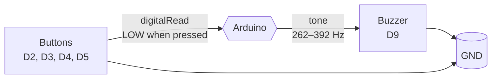

# 03 — Piano (Buzzer + Pushbuttons)

Simple 4-key piano using pushbuttons and a buzzer.

## Description

Four pushbuttons (wired with internal pull-up resistors) each trigger a specific musical note on a buzzer. When a button is pressed (active LOW), the Arduino generates a tone at the corresponding frequency using the `tone()` function.

## Components

| # | Component | Qty | Notes |
|---|-----------|-----|-------|
| 1 | Arduino Uno / Nano | 1 | Or any ATmega328P-based board |
| 1 | Buzzer | 1 | Passive buzzer (piezo) |
| 1 | Pushbutton | 4 | Momentary tactile switches |
| — | Breadboard + jumper wires | 1 set | |

## Wiring

```
                +5V
                 |
  Pin 2 (Arduino) ----[BUTTON]---- GND
  Pin 3 (Arduino) ----[BUTTON]---- GND
  Pin 4 (Arduino) ----[BUTTON]---- GND
  Pin 5 (Arduino) ----[BUTTON]---- GND

  Pin 9 (Arduino) ----> BUZZER ----> GND
```

- **Pushbuttons**: one pin to digital pins `2`, `3`, `4`, `5`; the other pin to `GND`. The internal `INPUT_PULLUP` resistor keeps the pin HIGH when the button is open; pressing pulls it LOW.
- **Buzzer**: positive pin to `D9`, negative pin to `GND`. Use a passive buzzer (not active) for variable frequency control.

> Pin `9` on Arduino Uno supports `tone()` for frequency generation.

## Code (`piano.ino`)

```cpp
int buzzerPin = 9;

int Do  = 2; 
int Re  = 3; 
int Mi  = 4; 
int Sol = 5;

void setup() {
  pinMode(buzzerPin, OUTPUT);
  
  pinMode(Do, INPUT_PULLUP);
  pinMode(Re, INPUT_PULLUP);
  pinMode(Mi, INPUT_PULLUP);
  pinMode(Sol, INPUT_PULLUP);
}

void loop() {
  if (digitalRead(Do) == LOW) {
    tone(buzzerPin, 262); 
  } 
  else if (digitalRead(Re) == LOW) {
    tone(buzzerPin, 294); 
  } 
  else if (digitalRead(Mi) == LOW) {
    tone(buzzerPin, 330); 
  } 
  else if (digitalRead(Sol) == LOW) {
    tone(buzzerPin, 392); 
  }
  else {
    noTone(buzzerPin);   
  }
}
```

## How It Works

1. `INPUT_PULLUP` enables the internal ~20 kΩ pull-up resistor on each button pin, keeping the pin at `HIGH` when the button is not pressed.
2. Pressing a button connects the pin to `GND`, pulling it to `LOW` (active LOW logic).
3. `digitalRead()` checks each button; when a button is LOW, `tone(buzzerPin, frequency)` generates a square wave at the specified frequency.
4. `noTone()` stops the tone when no button is pressed.
5. `loop()` runs continuously, so the piano responds in real time to button presses.

| Note | Frequency (Hz) | Musical Note |
|------|----------------|--------------|
| Do   | 262            | C4           |
| Re   | 294            | D4           |
| Mi   | 330            | E4           |
| Sol  | 392            | G4           |



## Uploading

1. Open Arduino IDE and install the **Arduino Uno** board (or your board's core).
2. Select the correct COM port under **Tools → Port**.
3. Open `piano.ino` and click **Upload** (Ctrl+U).
4. Press the buttons to play notes.

## Possible Improvements

- **More notes**: add more buttons and frequencies for a full octave.
- **Debouncing**: add a small delay or hardware debouncing capacitor to prevent multiple triggers from a single press.
- **Polyphony**: use multiple buzzer pins or a shift register to play multiple notes simultaneously.
- **Volume control**: add a potentiometer to control buzzer volume (requires PWM or a transistor circuit).
- **Song playback**: pre-program a melody array and play it automatically.
