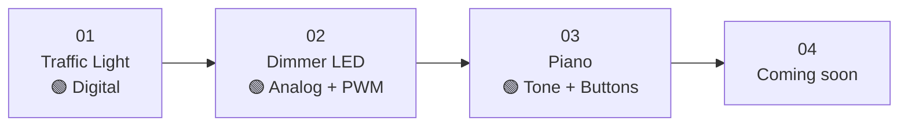

# Arduino Project Zero to Hero

A curated, beginner-friendly path through classic Arduino projects — from blinking a single LED to building sensor-driven circuits. Each project lives in its own folder with a self-contained sketch (`.ino`) and a README covering wiring, code, and theory.

> **Status:** 🚧 Work in progress — projects are added one by one, in increasing complexity.

---

## Table of Contents

| # | Project | Difficulty | Core concepts |
|---|---------|------------|---------------|
| 01 | [Traffic Light](./01_traffic_light/) | 🟢 Beginner | `digitalWrite`, `delay`, sequencing |
| 02 | [Dimmer LED (Potentiometer)](./02_dimmer_led/) | 🟢 Beginner | `analogRead`, `analogWrite` (PWM), `map()` |
| 03 | [Piano (Buzzer + Pushbuttons)](./03_piano/) | 🟢 Beginner | `tone()`, `INPUT_PULLUP`, active LOW logic |

More projects coming soon.

---
```
Arduino-Project-Zero-to-Hero/
├── README.md                  ← you are here
├── 01_traffic_light/          ← 3-LED traffic light (digital outputs)
│   ├── traffic-light.ino
│   └── README.md
├── 02_dimmer_led/             ← Potentiometer-controlled LED (analog + PWM)
│   ├── dimmer-led.ino
│   └── README.md
└── 03_piano/                  ← 4-key piano with buzzer (tone + buttons)
    ├── piano.ino
    └── README.md
```

Each project folder is **standalone** — open its `.ino` in the Arduino IDE and you're ready to upload.

---

- **Arduino Uno** (or Nano / Nano Every) — the recommended starting board.
- A handful of **5 mm LEDs** (red, yellow, green).
- **220 Ω resistors** for every LED.
- **10 kΩ potentiometer** (linear taper) — for projects involving analog input.
- **Passive buzzer** (piezo) — for tone generation projects.
- **Pushbuttons** (momentary tactile switches) — for input projects.
- **Breadboard** and **jumper wires** (M–M and M–F as needed).
- **USB cable** (Type-B for Uno, Mini-USB for Nano).

> Most projects run on **5 V** supplied by the USB port — no external power supply required.

---

## Getting Started

1. **Install the Arduino IDE** — [arduino.cc/en/software](https://www.arduino.cc/en/software) (works on Windows, macOS, Linux).
2. **Plug in your Arduino** with the USB cable.
3. In the IDE: **Tools → Board → Arduino Uno**, then **Tools → Port → (your COM/tty device)**.
4. Open any project's `.ino`, click **Upload** (→), and watch the magic happen.

---

## Conventions Used in Each Project

Every project README follows the same structure, so you always know where to look:

1. **Description** — what the project does.
2. **Components** — bill of materials with quantities and notes.
3. **Wiring** — ASCII diagram showing pin assignments.
4. **Code** — the full `.ino` listing.
5. **How It Works** — line-by-line explanation of the theory.
6. **Upload & Run** — quick steps to flash the sketch.
7. **Extensions** — ideas for taking the project further.

---

## Learning Path

If you're brand new to Arduino, work through the projects in order:



Each project builds on the previous one — by the end you'll have touched every core Arduino primitive: digital I/O, analog input, PWM output, timing, sensors, and serial communication.

---

## Contributing

Suggestions and improvements are welcome! Open an issue or a pull request on this repo. If you build a variant of any project, share it — the community learns best from real circuits.

## License

Released under the **MIT License** — fork it, learn from it, build cool things with it.
